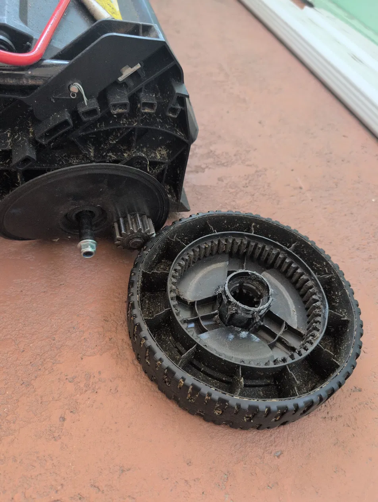
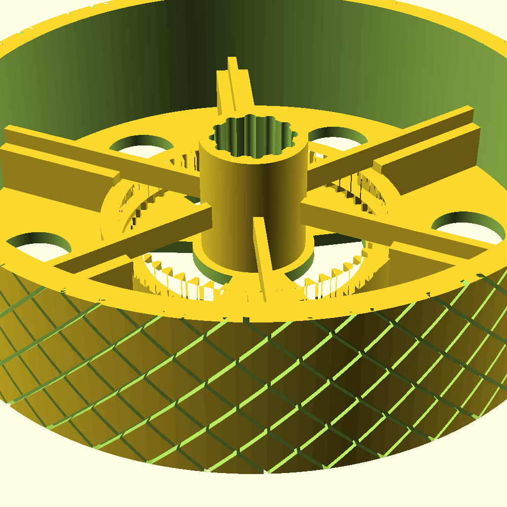

# printable mower drive wheel

Parametric OpenSCAD replacement for the 8 inch self propelled rear drive wheel on PowerSmart PH and SH series lawn mowers. Built for a PowerSmart DB2194PH whose left wheel stripped its hub ratchet teeth, which is the known weak point of this wheel.

## The patient



The 14 tooth steel pinion on the transmission (top left) drives the 52 tooth internal ring gear molded into the wheel. The chewed up collar in the center of the wheel is the hub ratchet interface, and it is what failed. The gear and tread were still fine. They almost always are.

## OEM cross reference

| OEM part | Side | Fits |
|---|---|---|
| 203050397A | Right | DB2194PH, DB2194SH, DB2321SM, DB8621PH, DB8621SH |
| 203050398A | Left | DB2194PH, DB2194SH, DB2321SM, DB8621PH, DB8621SH |

OEM runs about 15 dollars from powersmartusa.com. This project exists for when shipping is impractical, the part is out of stock, or you would rather print the part.

Lookalikes that do not work: the Toro 105-3036 Recycler wheel shares the same 52 tooth gear family but has a plain bore and lacks the hub ratchet interface. Troy Bilt and MTD 734-04018 wheels are 53 teeth and will not mesh at all.

## How this drivetrain works

* A 14 tooth steel pinion on the transmission output drives a 52 tooth internal ring gear molded into the wheel
* The wheel rides on a plain bushing over a shoulder bolt. There is no ball bearing anywhere in the wheel
* A ratchet key on the axle engages internal teeth in the wheel hub, acting as a one way clutch so the mower can free wheel backward
* Failure mode: the molded hub teeth shear, the key spins in the stripped collar, drive is lost

This design splits the hub into a separate printable insert so the wear part is a 22 gram reprint instead of a whole new wheel.

## Gear specs

| Spec | Value |
|---|---|
| Ring gear teeth | 52 internal |
| Module | 1.5875 (DP 16) |
| Pressure angle | 20 degrees |
| Pitch diameter | 82.55 mm |
| Gear ring OD at tooth roots | about 86.5 mm |
| Mating pinion | 14T steel, 22.2 mm pitch diameter |
| Center distance | 30.16 mm |
| Wheel envelope | 203.2 mm by 50.8 mm (8 in by 2 in) |

## Design renders

Gear side, showing the internal ring gear, splined hub socket, bridge ribs, and knurled tread:



Isometric detail of the hub socket and rigidity truss:


Face view showing the OEM style web gap sectors and lightening holes:


## Mesh verification

Cross section through the gear plane with a 14 tooth pinion silhouette placed at the correct 30.16 mm center distance. Teeth interleave with clearance and no interference:


## Files

| File | What |
|---|---|
| drive_wheel.scad | The whole project, fully parametric |
| wheel.stl | Wheel at default parameters, verify measurements first |
| hub_insert.stl | Replaceable splined hub insert with 10 internal teeth |
| failed_wheel.png | The donor failure that started all this |
| wheel_gearside.png, wheel_iso.png, wheel_top.png, slice.png | Renders and mesh proof |

## Measure before you print

Four numbers off your dead wheel decide fit. Update the parameters and re export.

| Measure | Parameter | Default guess |
|---|---|---|
| Bushing OD, the sleeve the wheel rides on | bore_d | 13.1 mm |
| Hub internal ratchet tooth count | bore_teeth | 0 (off), OEM looks like about 10 |
| Hub offset, face to face | hub_len | 44.45 mm |
| Gear ring OD across teeth | verify about 86 mm | |

The one that bricks a print: if your measured gear OD is meaningfully off from 86 mm, the gear module is different. Recalculate gear_module as measured pitch diameter divided by 52 before printing anything. Everything else is fixable with a file.

## Part selection

```openscad
part = "wheel";       // the main event
part = "hub_insert";  // sacrificial splined ratchet insert
part = "tire";        // optional TPU stretch over tire
part = "assembly";    // preview everything together
```

## Toggles worth knowing

```openscad
tread_style   = "knurl";   // "knurl" | "chevron" | "ribbed" | "slick"
web_gaps      = true;      // OEM style openings, roughly a third less filament
rigidity_ribs = true;      // truss over the gear tying hub to ring to rim
gear_backlash = 0.25;      // loosen if the steel pinion binds
```

The knurled tread is intentional. Use it bare, coat it with rubber cement or Plasti Dip or urethane, or print the matching TPU tire (part set to "tire") which keys into the knurl.

## Print settings

Test fit, about 3 to 4 dollars of filament: web_gaps true, rigidity_ribs false, tread_style "slick", 3 walls, 15 percent infill. Goal is to confirm gear mesh and bore fit only.

Service part:

* Material: PETG minimum. Carbon filled nylon or polycarbonate if you have it. PLA will die in heat plus gear load
* Orientation: gear face down, flat inboard face on the bed
* 5 to 6 walls, 40 percent or more gyroid, slicer modifier for 100 percent infill on the gear ring
* 0.2 mm layers or finer for the teeth
* Optional: anneal PETG for 30 minutes at 80 C for harder teeth
* Expect roughly 250 to 300 grams per wheel with web gaps on

Hub insert: 100 percent infill, no excuses. It is 22 grams.

## Install

1. Remove the flange nut and washer, pull the dead wheel
2. Recover the bushing and ratchet key, they transplant into the print. Inspect the key edges, a rounded off key eats new hubs
3. Press the hub insert into the wheel, seat the bushing, engage the key, slide the assembly onto the axle so the ring gear meshes the pinion
4. Washer, nut, grease, done. Spin test: drives forward, free wheels back

## Honest expectations

A printed gear against a steel pinion under mower load is a wear item. PETG is a season, maybe. The economics still work: the wheel costs about 5 dollars of filament and the part that dies first is a 10 minute reprint. Keep the OEM one on order if this mower is your only mower.

## Verification status

| Check | Status |
|---|---|
| Gear math against published 52T specs and 14T pinion | Done |
| Rendered in OpenSCAD, geometry visually inspected | Done |
| Pinion mesh verified in cross section at correct center distance | Done |
| STL exports manifold (CGAL reports Simple: yes), bbox exactly 8 in by 2 in | Done |
| Printed and field tested | Pending, that is your job, report back |

