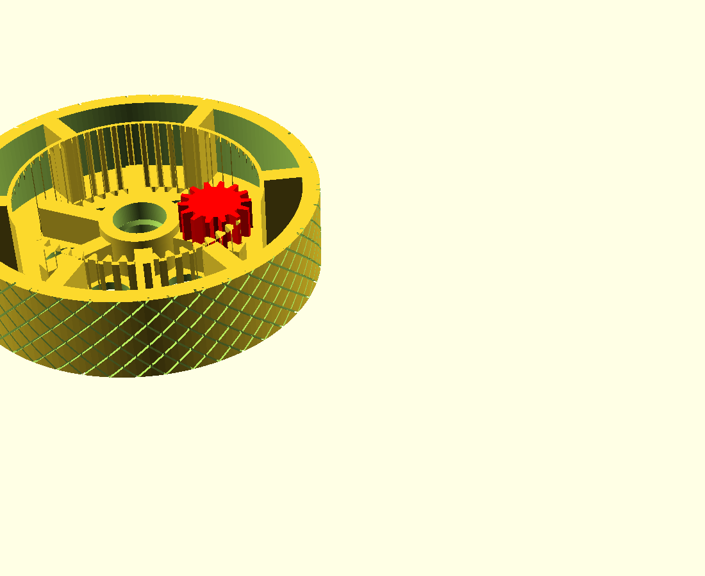
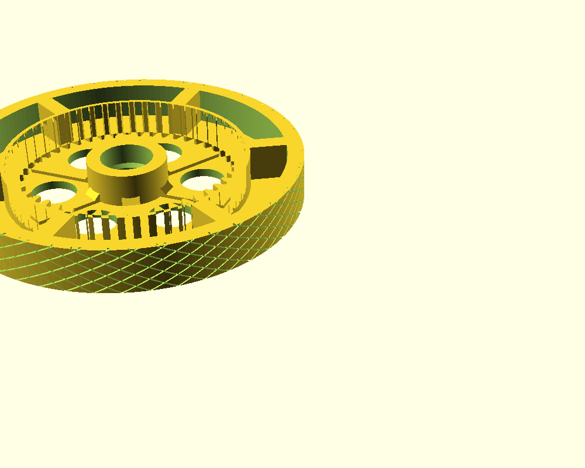

# printable mower drive wheel

3D printed replacement for the 8 inch rear drive wheel on a PowerSmart DB2194PH self propelled mower. OEM parts 203050397A right and 203050398A left. The stock wheel strips its hub teeth and the mower stops driving. This one prints in PETG with no supports and the gear was reverse engineered with calipers and test prints on the actual machine.

## The problem

Stripped hub on the OEM wheel. Gear and tread were fine, the mower just stopped pulling:

## The wheel

Full height vertical gear teeth, flat base, knurled tread. Prints face down with zero supports. Red gear in the renders is the mower pinion shown for clearance:

Skinny half width version for a cheap first drive test:

## Specs

| | |
|---|---|
| Ring gear | 52 teeth, internal, full height |
| Pinion on mower | 14 teeth, steel |
| Module | 2.5 |
| Ring outer | 136 mm |
| Center distance | 47.5 mm |
| Full wheel | 203 x 50 mm, knurled |
| Skinny wheel | 203 x 26 mm, knurled |
| Bearing | 30 mm OD, reuse the OEM one |
| Nut recess | 26 mm socket access from the back |

Module 2.5 was confirmed three ways with calipers (pinion 40 mm, ring envelope 140 mm, bolt to pinion gap 22 mm) and then a printed test ring meshed and rolled on the mower.

## Print order

| File | What | Cost |
|---|---|---|
| wheel_v6_skinny.stl | Half width working wheel. Drive the mower on it. | ~130 g |
| wheel_v6.stl | Full width final wheel. | ~280 g |

## Print settings

PETG. Print exactly as the STL sits, flat face on the bed. **No supports.** 4 to 6 walls, 40 percent infill. PLA will not survive Florida heat plus gear load. The design was machine audited: every downward face above the bed is under 45 degrees and nothing intrudes into the ring the pinion sweeps.

## Install

Drop the OEM bearing into the pocket from the gear side. Wheel onto the axle so the gear meshes the pinion. Washer and flange nut go on through the 26 mm recess in the back with a socket. Snug the nut to the bolt shoulder, do not crush it into the wheel. One way roll comes from the ratchet on the axle, not the wheel.

## Tuning

Everything is a variable at the top of drive_wheel_v6.scad:

* gear_backlash 0.40. Raise to 0.5 or 0.6 if the mesh binds or sounds gravelly under load
* pinion_reach 18. How deep the pinion engages from the top face. The hub gussets auto duck under it
* tread_style knurl, chevron, ribbed or slick
* wheel_width 50 or 26 or whatever you want
