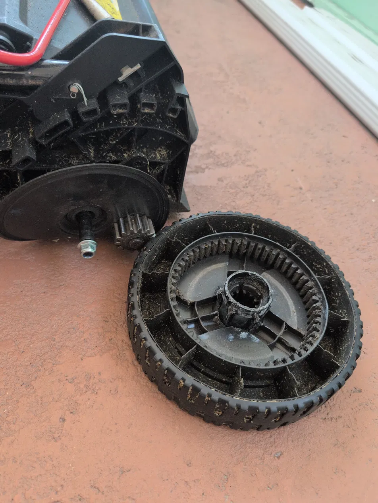
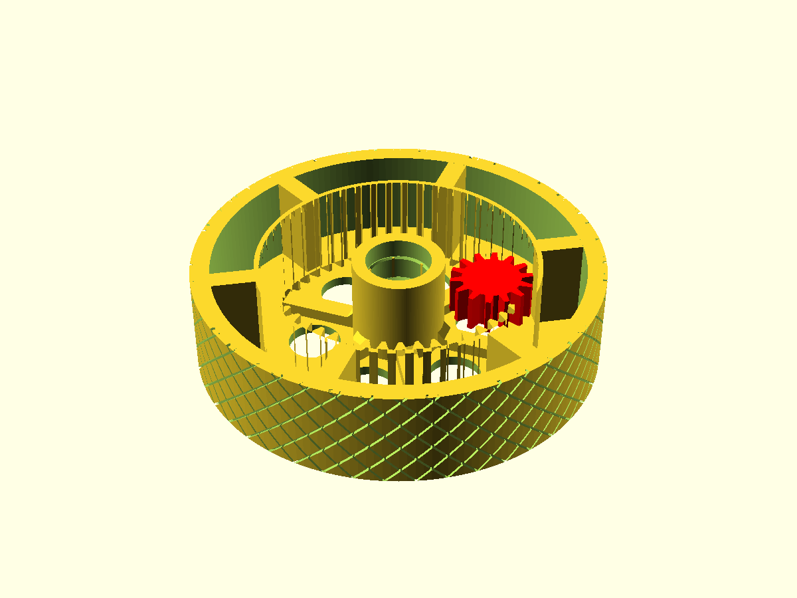
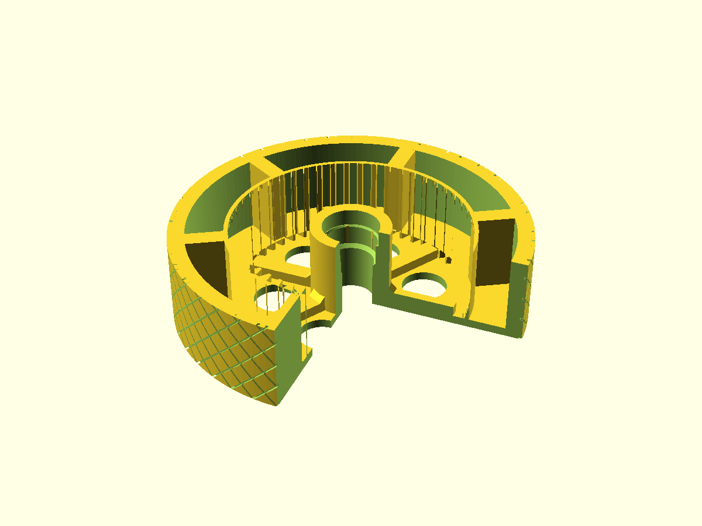

# printable mower drive wheel

3D printed replacement for the 8 inch rear drive wheel on a PowerSmart DB2194PH self propelled mower. OEM parts 203050397A right and 203050398A left. The stock wheel strips its hub teeth and the mower stops driving. This one prints in PETG with no supports and every dimension was measured off the real machine with calipers and test prints.

## The problem

Stripped hub on the OEM wheel. Gear and tread were fine, the mower just stopped pulling:

## The wheel

Full height vertical gear teeth, flat base, knurled tread, crush rib bearing pocket for a thermal press fit. Prints face down with zero supports. Red gear is the mower pinion shown for clearance:

Test ring meshing the steel pinion on the mower:

## Specs, all measured

| | |
|---|---|
| Ring gear | 52 teeth, internal, full height, module 2.5 |
| Pinion on mower | 14 teeth steel, 40 mm OD, reaches 25 mm off the housing |
| Ring outer | 136 mm, center distance 47.5 mm |
| Wheel | 203 x 50 mm, knurled, 217 with the brim ring |
| Bearing | OEM flanged, 13 bore x 30 body x 12 wide, 32 flange, 29 long with tube |
| Stud | 13 mm smooth for 40 mm, then 8 mm threads |
| Spacer | 11 mm, fills stud smooth 40 minus bearing tube 29 |

## Print order

| File | What | Cost |
|---|---|---|
| test_slice_v2.stl | Thin gear ring, verify mesh on your mower first | ~15 g |
| wheel_v8.stl | The wheel, brim ring built in | ~290 g |
| spacer_11mm.stl | The spacer, 100 percent infill | ~5 g |

## Print settings

PETG, ASA or similar. Print exactly as the STL sits, flat face on the bed. **No supports.**

**Brims are mandatory.** PETG curls at the rim of a 200 mm part and the lift wrecks the gear dimensions. The STL ships with a fat 7 mm snap off brim ring built in (1 mm tall, 5 layers, fused to the wheel edge by a quarter millimeter). Score the seam with a utility knife, peel it off, sand the edge. Turn the slicer's own brim and skirt OFF so they do not fight it.

5 to 6 walls, 40 percent infill. Clean bed, hot first layer, no fan for the first 5 layers, no drafts. PLA will not survive outdoor heat plus gear load.

## Install

1. Heat the hub with a hair dryer until hot to the touch. Press the bearing in flange first until flush. Cooling shrink plus the crush ribs lock it. Reheat to remove
2. Slide the 11 mm spacer onto the stud against the housing
3. Wheel onto the stud, gear side toward the mower
4. Nylock nut down the 26 mm tunnel with a deep socket, snug against the bearing tube end. The nut clamps the tube, never the wheel
5. Yank test for play, spin test for free, then mow

## Tuning

Everything is a variable at the top of drive_wheel_v8.scad:

* brim true or false, brim_w 7, brim_h 1.0. Widen it if your bed is bigger than 220
* rib_bite 0.30. Crush rib grip. Raise if your printer runs loose, lower if the bearing will not seat even hot
* gear_backlash 0.40. Raise to 0.5 or 0.6 if the mesh binds or sounds gravelly
* pinion_reach 24. Measured on this mower, remeasure on yours
* tread_style knurl or slick
